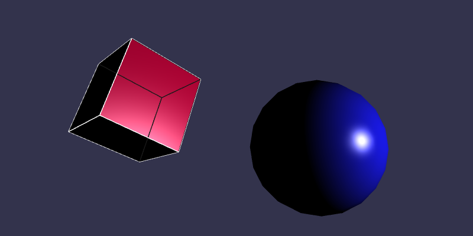
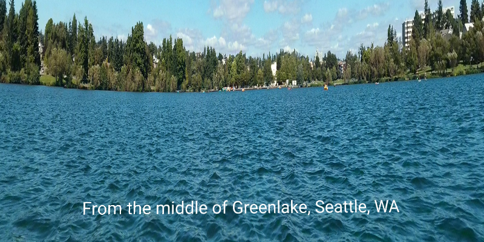
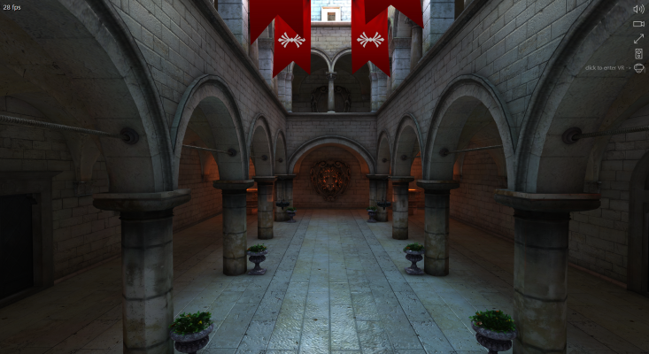
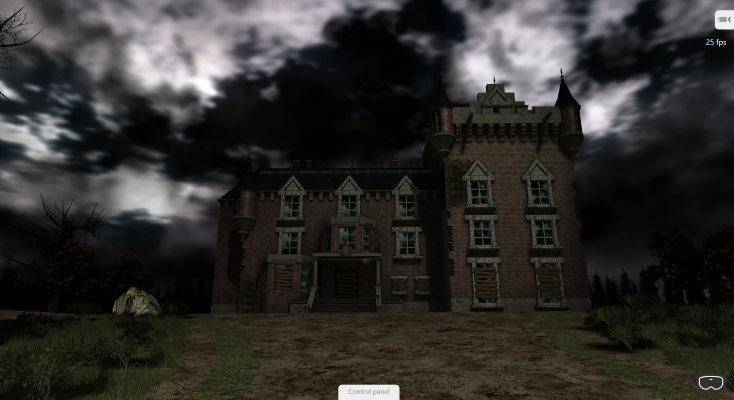

# WebVR Demos

Here's a list of WebVR demos that you can view in Edge running on a Windows Mixed Reality headset.

You can either open each VR experience from your computer and then put on your headset, or you can use Edge from within the Windows Mixed Reality home (plug in your headset and open the Mixed Reality Portal), navigate to this page, and open the experience.

## WebVR demos known to work in Edge

The following demos are known to work in Edge with a Windows Mixed Reality immersive headset. To open an experience, click on the picture or link. To enter VR, make sure your headset is plugged in, and select the VR button, which is usually in the bottom right of the window.

Occasionally you may find that a VR experience doesn't load properly (it stays on a black screen with revolving white spheres). Simply exit the experience by pressing the Windows button on your controller, reload the page, and try again.

If you don't have a VR headset, don't worry&mdash;these demos also work with the mouse. Simply hold the left mouse button down and drag the mouse around to turn the camera.

> [!NOTE]
> Sometimes, a CodePen might freeze if you try interacting with it on this page. Click **Edit on CodePen** in the upper right corner to view it on the CodePen website, where it should work fine.

* Rendering and animating simple shapes using [Babylon.js](//www.babylonjs.com/):

 
 

* Rendering and animating shapes using [A-Frame](//aframe.io):

 
 

* Viewing a 360-degree photograph using [A-frame](//aframe.io):

* [Sponza VR](https://www.babylonjs.com/demos/sponza/) (interior castle scene) using [Babylon.js](https://www.babylonjs.com/) by the Babylon.js team
    * Open the link, then select the **Switch to VR mode** button on the right.

* [Hill Valley VR](https://www.babylonjs.com/demos/hillvalleyvr/) using [Babylon.js](https://www.babylonjs.com/) by Camille Joly and Michel Rousseau
    * Open the link, then select the VR button in the bottom right.

* [Mansion VR](https://www.babylonjs.com/demos/mansionvr/) using [Babylon.js](https://www.babylonjs.com/) by Michel Rousseau
    * Open the link, then select the VR button in the bottom right.

* [View a basic mesh and interact with a GUI in WebVR](https://www.babylonjs-playground.com/#TAFSN0#2) (Babylon.js)
    * Open the link, then select the VR button in the bottom right.

* [Glowing Espilit](http://www.babylonjs.com/demos/glowingespilit/) (modern, open architecture demo) using [Babylon.js](https://www.babylonjs.com/) by Michel Rousseau
    * Open the link, then select the VR button in the bottom right.

## See more

* [Your mixed reality home](https://docs.microsoft.com/windows/mixed-reality/enthusiast-guide/your-mixed-reality-home)
* [Babylon.js](https://www.babylonjs.com/)
* [WebVR with Microsoft Edge](webvr-with-edge.md)
