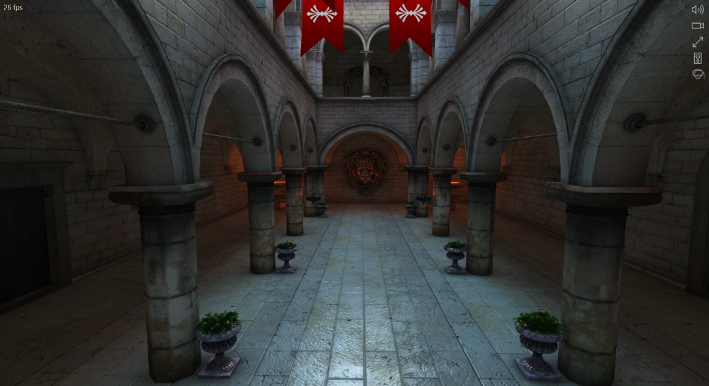

# WebVR Developer's Guide
WebVR is an open standard JavaScript API that makes it possible to experience immersive 3D Virtual Reality (VR) applications using a web browser like Microsoft Edge and a supported VR headset.

Check out this [Babylon.js](//www.babylonjs.com/) sample in virtual reality once you've plugged in a Windows Mixed Reality headset. Click the picture below, then select the **Switch to VR mode** button on the right.

 

    

<ul class="cardsK panelContent">
    <li>
        

            

                

                    

                        

                            
                        

                    

                    

                        <h3>Fundamentals</h3>
                        
Learn about what WebVR is, and the necessary first steps to get set up.

                         
                        <ul>
                            <li><a href="what-is-webvr.md">What is WebVR?</a></li>
                            <li><a href="hardware.md">Hardware</a></li>
                            <li><a href="webvr-with-edge.md">Using WebVR with Microsoft Edge</a></li>
                        </ul>
                    

                

            

        

    </li>
    <li>
        

            

                

                    

                        

                            
                        

                    

                    

                        <h3>Development</h3>
                        
Read about handling input in WebVR, and how to develop for WebVR on Windows 10.

                         
                        <ul>
                            <li><a href="input.md">Input</a></li>
                            <li><a href="webvr-in-pwas.md">WebVR in Progressive Web Apps</a></li>
                            <li><a href="webvr-in-webview.md">WebVR in WebView</a></li>
                        </ul>
                    

                

            

        

    </li>
    <li>
        

            

                

                    

                        

                            
                        

                    

                    

                        <h3>Resources</h3>
                        
Check out these videos and articles for best practices when developing with WebVR.

                         
                        <ul>
                            <li><a href="essentials.md">WebVR functionality checklist</a></li>
                            <li><a href="resources.md">WebVR resources</a></li>
                        </ul>
                    

                

            

        

    </li>
</ul>

---

<h2>More resources</h2>

<ul class="panelContent cardsFTitle">
    <li>
        <a href="//developer.microsoft.com/en-us/windows/mixed-reality">
        

            

                

                    

                        

                            
                        

                    

                    

                        <h3>Windows Mixed Reality</h3>
                    

                

            

        

        </a>
    </li>
    <li>
        <a href="//developer.microsoft.com/en-us/windows/mixed-reality/immersive_headset_hardware_details">
        

            

                

                    

                        

                            
                        

                    

                    

                        <h3>Immersive headset hardware details</h3>
                    

                

            

        

        </a>
    </li>
    <li>
        <a href="demos.md">
        

            

                

                    

                        

                            
                        

                    

                    

                        <h3>Demos</h3>
                    

                

            

        

        </a>
    </li>
  </ul>

<ul class="panelContent cardsFTitle">
    <li>
        <a href="//github.com/w3c/webvr/blob/master/explainer.md">
        

            

                

                    

                        

                            
                        

                    

                    

                        <h3>W3C WebVR working group</h3>
                    

                

            

        

        </a>
    </li>
    <li>
        <a href="//developer.microsoft.com/en-us/windows/mixed-reality/community">
        

            

                

                    

                        

                            
                        

                    

                    

                        <h3>Mixed Reality Community</h3>
                    

                

            

        

        </a>
    </li>
    <li>
        <a href="//www.linkedin.com/groups/13500607/profile">
        

            

                

                    

                        

                            
                        

                    

                    

                        <h3>WebVR Developers on LinkedIn</h3>
                    

                

            

        

        </a>
    </li>
</ul>