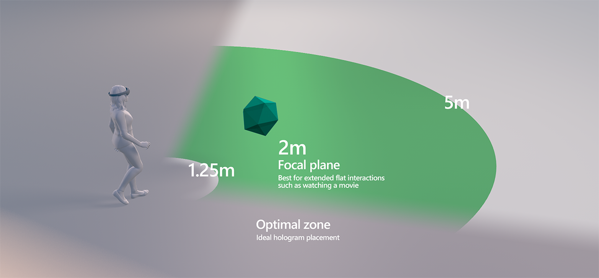

# User Comfort
The human body is very sensitive to various cues, including visual, auditory, touch etc. It uses all of these in combination to maintain a sense of orientation. If any of these senses reports something that the brain doesn't expect, the user will rapidly experience discomfort or nausea. A real world parallel is motion sickness, which in some cases can be completely debilitating.

Everybody is different - something that feels fine for you may cause crippling nausea for other people. A common experience in VR apps that can instantly cause nausea is in some people but not others is translation: using a thumbpad or WASD to 'walk'. Affected people will suffer within seconds - it is not only prolonged exposure that you need to worry about.

There is comprehensive must-read [comfort documentation](https://developer.microsoft.com/en-us/windows/mixed-reality/comfort) on the Windows Dev Center, however some of the important takeaways are summarized below:

## Assume all headsets are 6DOF
Only some of the headsets on the market right now have sensors capable of reporting full [6DOF](https://en.wikipedia.org/wiki/Six_degrees_of_freedom) motion, some have sensors that will only report head rotation. Sensor limitation does not prevent the device from making a guess about its location in space via neck modelling techniques, which users find [uncomfortable if omitted](https://www.reddit.com/r/oculus/comments/3uhs63/why_dont_all_gear_vr_apps_have_the_neck_model_its/).

Omitting head position support will cause discomfort for users, especially when objects are rendered close to their head. By supporting the full six degrees of motion in your app, not only do you increase comfort for 3DOF headset users, you will get the benefit of full room scale support for free with devices that support it.

360 video presents an interested exception to this case, since the camera itself was fixed in space when the video was recorded. The best practice here is to simply make the sphere/cube on which you project the video very large in space (say, 100x100m) so that any in-world UI elements you may add will respect head movement.

## Constant, high frame rate
<!-- LW: Not happy with this section
 -->
One thing that is especially jarring for users and can cause extreme discomfort is a sudden pause in rendering. It is critical that the application draws to the headset at the hardware defined screen refresh rate. While a constant low frame rate is typically caused by expensive code in the `requestAnimationFrame` callback or GPU wait, a sudden stop in rendering is typically caused by blocking code in `requestAnimationFrame`, or a failure to queue another callback. 

Extra caution will need to be taken if you perform loading or creation of assets within the render loop, while rendering to the headset. It is preferable to show a simple, dark loading screen consideration in the headset while expensive main thread operations take place.

## Focal Zone
Placement of objects in the world with respect to the viewers focal point is also important for comfort. 

To view objects clearly, humans must [accommodate](https://en.wikipedia.org/wiki/Accommodation_%28eye%29), or adjust their eyes’ focus, to the distance of the object. At the same time, the two eyes must [converge](https://en.wikipedia.org/wiki/Convergence_(eye)) to the object’s distance to avoid seeing double images. In natural viewing, vergence and accommodation are linked. When you view something near (e.g. a housefly close to your nose) your eyes cross and accommodate to a near point. Conversely, if you view something at infinity, your eyes’ lines of sight become parallel and the your eyes accommodates to infinity. In most head-mounted displays users will always accommodate to the focal distance of the display (to get a sharp image), but converge to the distance of the object of interest (to get a single image). When users accommodate and converge to different distances, the natural link between the two cues must be broken and this can lead to visual discomfort or fatigue.

### Best practices

The precise value for the focal distance varies per device as it depends on the setup of the display. In general, focal distance to displays are between 1.25m-2m. 

- Try and keep most content at least 1m away from the display - use a pixel shader start fading out at that distance, with a clipping plane at 0.85m. 
- Avoid putting content further away than 5m - user fatigue increases the further away objects are outside of the focal range.
- Objects that move in depth (especially close to the user) are likely to increase user fatigue.
- If a user spends >25% of the time with objects closer <1m away, or moving in depth, we recommend careful user testing to ensure it remains comfortable.

### Examples

__Movie screens__, or other items that you expect the user to look at for extend periods, should be as close to the focal plane as possible (1.25m-2m away from the user). If in doubt, provide the user a method to move closer or farther from a point of interest.

__User interface__ elements in-world should be on the focal plane so as to maximise user comfort (don't place them closer than 1.25m).

__Tracked controller__ 3D representations will often be closer to the user than the focal guidance above. Use best judgment - use the 3D controller models to assist with user awareness of where their hands are, rather than as an information display/HUD. The general guidance is that the application should maximize comfort for users - if necessary fade the controllers to transparent if they are held closer than a 'cross eyes' distance or too close to the face. 
